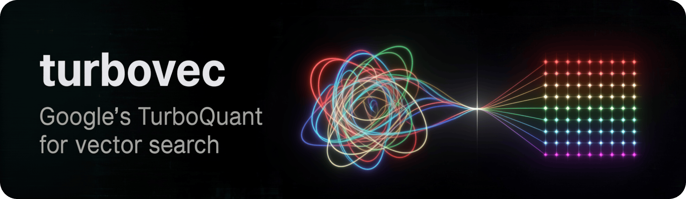
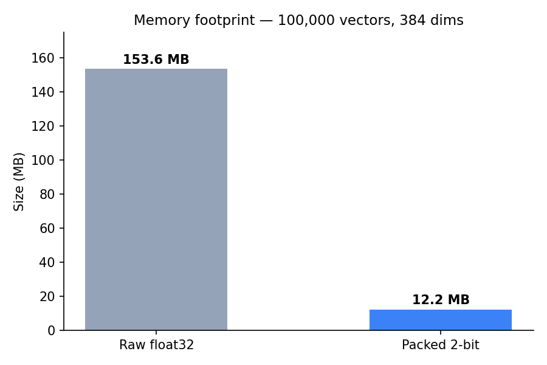
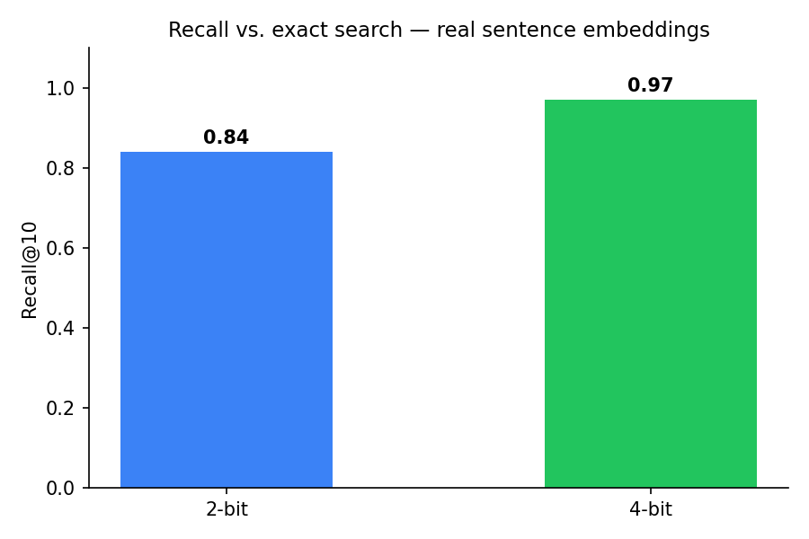

<p align="center">
  
</p>

<p align="center">
  
  
  
</p>

---

**153.6 MB of float32 embeddings compresses to 12.2 MB. Search stays within 1.5x of Apple's BLAS.**

A personal reimplementation of Google Research's **TurboQuant** algorithm — a vector quantizer with no separate training phase. Built as a study of the public [turbovec](https://github.com/RyanCodrai/turbovec) project, in two phases:

- **`prototype/`** — Python/NumPy, used to validate the algorithm before writing Rust.
- **`core/`** — Rust port: NEON SIMD, multi-threading, Python bindings via PyO3.

- **No training step.** Vectors are indexed on add.
- **NEON SIMD**, verified against a scalar fallback.
- **Parallel search** via `rayon`.
- **Python bindings** via PyO3 + maturin.
- **12.6x compression**, measured on 100K vectors, full serialized index.
- **0.84 recall@10** at 2-bit, measured against exact search on real sentence embeddings.

## Python

```bash
pip install maturin
maturin develop --release
```

```python
import turbovec_lite_rs

index = turbovec_lite_rs.IdMapIndex(dim=384, seed=42)
index.add_with_ids(vectors, ids)          # vectors: flat list, row-major (n * dim)
scores, result_ids = index.search(query, k=10)
index.remove(some_id)
index.write("index.tvim")
loaded = turbovec_lite_rs.IdMapIndex.load("index.tvim")
```

## Rust

```rust
use turbovec_lite_rs::IdMapIndex;

let mut index = IdMapIndex::new(384, 42);
index.add_with_ids(&vectors, &ids);
let (scores, result_ids) = index.search(&query, 10);
index.remove(some_id);
index.write("index.tvim").unwrap();
let loaded = IdMapIndex::load("index.tvim").unwrap();
```

## How it works

1. **Normalize.** Split each vector into direction (unit length) and magnitude.
2. **Rotate.** Multiply every vector by the same fixed random orthogonal matrix. Distances between vectors don't change, but each coordinate becomes statistically predictable.
3. **Quantize.** Since the post-rotation distribution is known, Lloyd-Max buckets are computed directly from the math — 4 buckets at 2-bit, 16 at 4-bit.
4. **Pack.** Four 2-bit codes per byte — ~16x raw compression before metadata.
5. **Correct.** Quantization shrinks inner products between original and reconstructed vectors. A per-vector correction, computed once at insertion and clamped to a safe range, fixes this at search time.

Search rotates the query into the same space and scores it directly against the packed database — no decompression step.

## Results

<p align="center">
  
</p>

<p align="center">
  
</p>

**Search speed** — 5K vectors, 384-dim, 100 queries, Apple Silicon, vs. NumPy/BLAS:

| Version | Time/query | vs. NumPy |
|---|---|---|
| Scalar Rust, naive | 45.1 ms | 200x slower |
| Scalar Rust, fused | 25.2 ms | 108x slower |
| NEON, release | 0.588 ms | 2.7x slower |
| NEON + rayon, release | **0.461 ms** | **1.5x slower** |

## Bugs found along the way

- **Correction factor could go negative.** Near-orthogonal reconstructions drove the length-renormalization divisor toward zero, occasionally inverting search rankings. Fixed by clamping the correction to a bounded range.
- **Debug builds hid the SIMD gain entirely.** `maturin develop` defaults to debug mode — the NEON kernel measured 92x slower than it should have, until built with `--release`.
- **A swapped tuple unpack** (`DIM, N = vectors.shape` instead of `N, DIM = ...`) caused an out-of-bounds panic in Rust, traced back through a full backtrace to one line in Python.

## Building

```bash
cd core
cargo test          # unit tests: rotation, quantization, packing, SIMD-vs-scalar parity
```

`cargo test`/`cargo build` can't link once PyO3 bindings are in the crate — `extension-module` skips linking libpython on purpose. Verify through Python instead:

```bash
maturin develop --release
```

## Scope

Not a production library. Missing, relative to the original turbovec: bit widths other than 2-bit, an x86 SIMD kernel (NEON only), filtered search, framework integrations, a formal FAISS benchmark.

## References

- [TurboQuant](https://arxiv.org/abs/2504.19874) — ICLR 2026
- [RaBitQ](https://arxiv.org/abs/2405.12497) — SIGMOD 2024
- [turbovec](https://github.com/RyanCodrai/turbovec) — the project this studies
